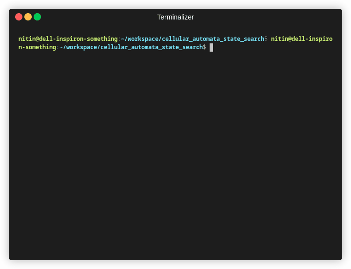

## CAS3 - Cellular Automata State Space Search for Prime Generation

Prime numbers are intriguing, they compose all other numbers. Cellular automata is a computational paradigm which has a simple set of rules, works in an N-dimensional grid with a start state, and rules being applied iteratively to every cell in parallel. The rules have input as a cell's immediate neighbours, and output as a state of the cell. For simplicity, the state can be thought of as ON or OFF.

This project attempts to figure out if there is an N-dimensional cellular automata which will generate the prime number sequence. The resulting cell-cluster would combine to form all other numbers in our universe!  

This project is not computationaly feasible, and is hence a learning project. Contributions are welcome, if you think you can make it do the search faster, do ping me or send in a PR.

I found it generating rules for sequence such as :
 1,2,3,4..
 1,3,5,7..
 1,4,9,25,36..
 The most interesting I've found has been 1, 3, 5, 9, 11, 15, 19, 27

### Space
Start with one cell, apply rules. If successful, the applied rules would produce blocks of cells which are set, and the number of cells in such a block would be prime numbers :D

### Cell
N-dimensional vector (Co-ordinates) + Value. Value is either Set or Unset

### Rule

One rule specifies which neighbours to check, what check to be done and what rule should be applied.

Which neighbours to check -  This is defined by the "elements" vector, where each element has 3 values: SameCoordinate, Positive, Negative
As expected of the naming, when this rule is checked against a cell, it'll check it's neighbours, changing ith coordinate accordingly (SameCoordinate - no change, Positive - +1, Negative - -1)

What check to be done – Is whether the specified neighbours are set or not set. Rule has ExpectedCellValue which checks if the neighbours are as expected

What rule should be applied – Is whether the corresponding cell should be set, unset or flipped in value. RuleResult does this.

### Dimensions

Number of dimensions of the universe is unknown. We need to generate for increasing numbers, starting at 3 (since we live in 3 dimensions)

State space search:
Stop the search if successive applications of rule is not producing the next prime number in sequence (1,2,3,5,7,11,13...)

## Current status

Using a Core-i5 laptop, it can generate rules upto maybe 2nd dimension if you run it long enough. No, we haven't found a rule which produce prime numbers. I have a feeling it requires 137 dimensions :)
